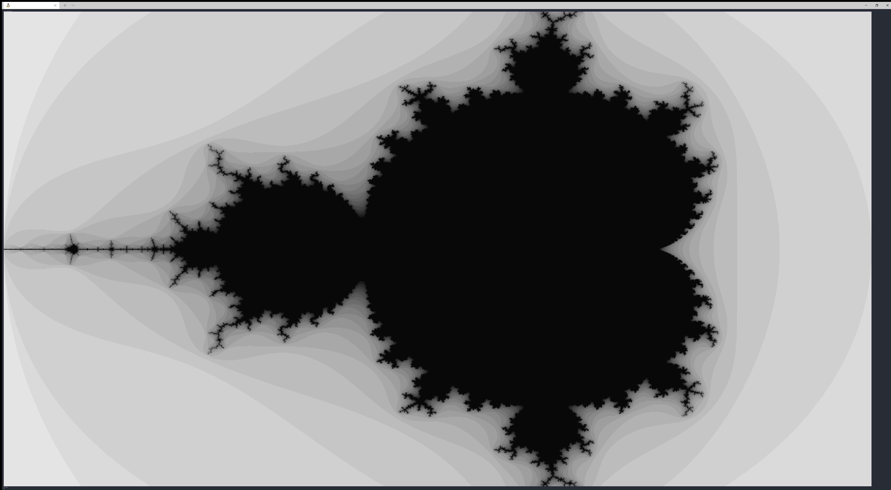

# The Calc4 Programming Language

Calc4 is a programming language where everything in its code is an operator.

## Try It Out

To try Calc4 via your web browser, please visit [Try Calc4](https://proprowataya.github.io/calc4/). This website allows you to run the Calc4 source code you type on the fly.

## Overview

The design of Calc4 is inspired by calculators. Calc4 allows you to program as if you were pressing the calculator's buttons. First of all, look at the next examples of Calc4 programs.

* Arithmetic operation
    ```
    46 + 2
    ```
* The Fibonacci sequence
    ```
    38{fib}
    ```

The first one is very simple and is exactly the same as using a calculator. The second one is worth noting. As you can imagine from the name, the ```{fib}``` computes the 38th Fibonacci sequence. This is similar to the Fibonacci button on a calculator. In other words, the code above can be thought of as the following actions on a calculator:

1. Create a new Fibonacci button on a calculator
1. Press the "3" button
1. Press the "8" button
1. Press the Fibonacci button

To achieve this style of programming, Calc4 introduces the concept that "everything is an operator". For example, the Fibonacci button is represented as a unary operator. Here, please be noted that this operator (or button) is not provided by default, but is defined manually by the programmer. In fact, "3" and "8" are also operators. The detail will be presented in the next section.

Despite such simple grammar, Calc4 is capable of performing various complex computations such as the Mandelbrot set shown below. The Mandelbrot set program is available [here](sample/MandelbrotSet.txt).

#### Mandelbrot Set Drawn by Calc4


## Key Features of Calc4

### Everything is an Operator

The biggest feature of Calc4 is that the program consists only of operators in infix notation. Let me explain this by using the next sample code of Calc4.

* Calc4 Sample Code 1
    ```
    46 + 2
    ```

The ```+``` in the above is of course an operator, but ```4```, ```6```, and ```2``` are also operators. The operator ```6``` takes one operand and returns ``(operand * 10) + 6``. Its operand is the result of the operator ```4```.

That is to say, code 1 is equivalent to the following C code.

```c
int operator2(int operand) {
    return (operand * 10) + 2;
}

int operator4(int operand) {
    return (operand * 10) + 4;
}

int operator6(int operand) {
    return (operand * 10) + 6;
}

int zeroOperator() {
    return 0;
}

return operator6(operator4(zeroOperator())) + operator2(zeroOperator());
```
* **NOTE:** The operator ```2``` and ```4``` in code 1 implicitly take a constant value 0, namely zero operators, as their operands.

Since the main goal of Calc4 is to program in the style of calculators, "46" is not a single token but is divided into two operators. In this manner, all code elements are expressed as operators in Calc4.

### Highly Expressiveness Powered by Recursive Operators

Everything in Calc4 is an operator, but this does not mean Calc4 cannot represent complex programs. Calc4 offers a way to define custom operators. For example, you can define your original addition operator as follows. Here,  ```D``` is an operator to define a new operator.

```
D[myadd|x, y|x + y] 12{myadd}23
```

Popular programming languages such as C provide loops to express complicated algorithms. Calc4 does not have such syntax. Instead, custom operators calling themselves, i.e. recursive operators, are available. The next code is the definition of the Fibonacci operator we saw earlier. You can find a typical recursive call.

```
D[fib|n|n <= 1? n ? (n-1){fib} + (n-2){fib}] 38{fib}
```

A more complex example is [the image at the beginning of this README](#mandelbrot-set-drawn-by-calc4), the Mandelbrot set drawn by Calc4. The program is available [here](sample/MandelbrotSet.txt). It utilizes [tail recursions](https://en.wikipedia.org/wiki/Tail_call) instead of loops.

Another sample code is also available.
* [Printing prime numbers up to 100](sample/PrintPrimes.txt)

## Getting Started

If you wish to simply try Calc4, the [Try Calc4](https://proprowataya.github.io/calc4/) website is the best choice. Below are the steps to build a native Calc4 environment.

### Requirements

* C++ compiler supporting C++17
* [CMake](https://cmake.org/) (>= 3.8)
* (git)

### Building Calc4

1. Install CMake
    * dnf
        ```
        sudo dnf install cmake -y
        ```
    * apt
        ```
        sudo apt update
        sudo apt install cmake -y
        ```
    * Binary
        * https://cmake.org/
1. Build and run
    * Unix-like systems
        ```
        git clone https://github.com/proprowataya/calc4.git
        mkdir calc4-build
        cd calc4-build
        cmake ../calc4
        cmake --build .
        ./calc4 ../calc4/sample/MandelbrotSet.txt
        ```
    * Windows
        ```
        git clone https://github.com/proprowataya/calc4.git
        mkdir calc4-build
        cd calc4-build
        cmake ..\calc4
        cmake --build . --config Release
        .\Release\calc4.exe ..\calc4\sample\MandelbrotSet.txt
        ```

If nothing is specified as a command-line argument, Calc4 works as REPL. Please input what you want to evaluate.

```
$ ./calc4
Calc4 REPL
    Integer size: 64
    Executor: StackMachine
    Optimize: on

> 72P101P108P108P111P32P119P111P114P108P100P33P10P
Hello world!
0
Elapsed: 0.1183 ms

> D[fib|n|n <= 1? n ? (n-1){fib} + (n-2){fib}] 38{fib}
39088169
Elapsed: 1457.58 ms

>
```

### JIT Compilation (Optional)

You can use the JIT compiler supported by LLVM. The steps to enable JIT compilation are as follows.

1. Install [LLVM](https://llvm.org/)
    * apt
        ```
        sudo apt update
        sudo apt install llvm-dev -y
        ```
    * dnf
        ```
        sudo dnf install llvm-devel -y
        ```
    * Windows
        * You need to build the LLVM from the source code. Please follow [the official instructions](https://llvm.org/docs/GettingStartedVS.html).
        * Make sure that ```llvm-config.exe``` is added to the PATH.
1. Build again with an option
    * Unix-like systems
        ```
        cmake ../calc4 -DENABLE_JIT=ON
        cmake --build .
        ./calc4
        ```
    * Windows
        ```
        cmake ..\calc4 -DENABLE_JIT=ON
        cmake --build . --config Release
        .\Release\calc4.exe
        ```

## Sample Codes

### Hello world

* Calc4 Sample Code
    ```
    72P101P108P108P111P32P119P111P114P108P100P33P10P
    ```
* Equivalent to the following C code
    ```c
    putchar('H');
    putchar('e');
    putchar('l');
    putchar('l');
    putchar('o');
    putchar(' ');
    putchar('w');
    putchar('o');
    putchar('r');
    putchar('l');
    putchar('d');
    putchar('!');
    putchar('\n');
    return 0;
    ```
* Result
    ```
    > 72P101P108P108P111P32P119P111P114P108P100P33P10P
    Hello world!
    0
    Elapsed: 0.1312 ms
    ```
* The ```P``` operator prints the given operand as a character to the console. The value of the ```P``` operator itself is zero.

### Addition

* Calc4 Sample Code
    ```
    12 + 23
    ```
* Equivalent to
    ```c
    return 12 + 23;
    ```
* Result
    ```
    > 12 + 23
    35
    Elapsed: 0.0216 ms
    ```

### Addition and Multiplication

* Calc4 Sample Code
    ```
    1 + 2 * 3
    ```
* Equivalent to
    ```c
    return (1 + 2) * 3;
    ```
    * Not `1 + (2 * 3)`.
* Result
    ```
    > 1 + 2 * 3
    9
    Elapsed: 0.0193 ms
    ```
* This code is not evaluated to 7. The reason for this will be explained [later](#operator-precedence).

### Defining Custom Operators

* Calc4 Sample Code
    ```
    D[myadd|x, y|x + y] 12{myadd}23
    ```
* Equivalent to
    ```c
    int myadd(int x, int y) {
        return x + y;
    }

    return myadd(12, 23);
    ```
* Result
    ```
    > D[myadd|x, y|x + y] 12{myadd}23
    35
    Elapsed: 0.0765 ms
    ```

### Conditional Operators

* Calc4 Sample Code
    ```
    1 == 2 ? 10 ? 20
    ```
* Equivalent to
    ```c
    return 1 == 2 ? 10 : 20;
    ```
* Result
    ```
    > 1 == 2 ? 10 ? 20
    20
    Elapsed: 0.0727 ms
    ```

### Operators with Many Operands

* Calc4 Sample Code
    ```
    D[sum|a, b, c, d, e|a + b + c + d + e] 1{sum}2{sum}3{sum}4{sum}5
    ```
* Equivalent to
    ```c
    int sum(int a, int b, int c, int d, int c) {
        return a + b + c + d + e;
    }

    return sum(1, 2, 3, 4, 5);
    ```
* Result
    ```
    > D[sum|a, b, c, d, e|a + b + c + d + e] 1{sum}2{sum}3{sum}4{sum}5
    15
    Elapsed: 0.1059 ms
    ```
* Calc4 allows operators with many operands.

### Fibonacci Sequence (naïve version)

* Calc4 Sample Code
    ```
    D[fib|n|n <= 1? n ? (n-1){fib} + (n-2){fib}] 38{fib}
    ```
* Equivalent to
    ```c
    int fib(int n) {
        return n <= 1 ? n : fib(n - 1) + fib(n - 2);
    }

    return fib(38);
    ```
* Result (with JIT compilation)
    ```
    > D[fib|n|n <= 1? n ? (n-1){fib} + (n-2){fib}] 38{fib}
    39088169
    Elapsed: 158.858 ms
    ```
* `fib` is slow because its order is exponential.

### Fibonacci Sequence (tail call version)

* Calc4 Sample Code
    ```
    D[fib2|x, a, b|x ? ((x-1) ? ((x-1) {fib2} (a+b) {fib2}a) ? a) ? b] 38{fib2}1{fib2}0
    ```
* Equivalent to
    ```c
    int fib2(int x, int a, int b) {
        if (x == 0) {
            return b;
        } else if (x == 1) {
            return a;
        } else {
            return fib2(x - 1, a + b, a);
        }
    }

    return fib2(38, 1, 0);
    ```
* Result (with JIT compilation)
    ```
    > D[fib2|x, a, b|x ? ((x-1) ? ((x-1) {fib2} (a+b) {fib2}a) ? a) ? b] 38{fib2}1{fib2}0
    39088169
    Elapsed: 7.289 ms
    ```
* `fib2` is much faster than `fib`.

### Variables

* Calc4 Sample Code
    ```
    (123S)
    (L)
    ```
* Equivalent to
    ```c
    int __default_var;

    /* 123S */
    __default_var = 123;

    /* L */
    return __default_var;
    ```
* Result
    ```
    > 123S
    123
    Elapsed: 0.068 ms

    > L
    123
    Elapsed: 0.032 ms
    ```
* The operator ```S``` stores the given operand to the variable, and ```L``` loads it. The previous example loads and stores the default variable. To specify the variable name, write like ```S[abc]```, ```L[abc]```.
* All variables are global, so their values are shared among operator calls.

### Memory Accesses

* Calc4 Sample Code
    ```
    (123->10)
    (10@)
    ```
* Equivalent to
    ```c
    int __memory[VERY_LARGE_SIZE];

    /* 123->10 */
    __memory[10] = 123;

    /* 10@ */
    return __memory[10];
    ```
* Result
    ```
    > 123->10
    123
    Elapsed: 0.0493 ms

    > 10@
    123
    Elapsed: 0.0389 ms
    ```
* Calc4 has a very large memory accessible from anywhere. The operator ```->``` and ```@``` accesses the memory. The ```->``` operator stores the left operand's value to the memory of the location of the right one.
* The negative indices are also allowed.
* The parentheses in the above code are required. If they are missing, the code will be interpreted as ```123->1010@```. This incomprehensible behavior is due to the handling of line breaks, which should be reconsidered in the future.

### Tarai Function

[Tarai function](https://en.wikipedia.org/wiki/Tak_(function)) is often used when benchmarking programming languages.

* Calc4 Sample Code
    ```
    D[tarai|x, y, z|x <= y ? y ? (((x - 1){tarai}y{tarai}z){tarai}((y - 1){tarai}z{tarai}x){tarai}((z - 1){tarai}x{tarai}y))] 18{tarai}15{tarai}5
    ```
* Equivalent to
    ```c
    int tarai(int x, int y, int z) {
        if (x <= y) {
            return y;
        } else {
            return tarai(tarai(x - 1, y, z), tarai(y - 1, z, x), tarai(z - 1, x, y));
        }
    }

    return tarai(18, 15, 5);
    ```
* Result (with JIT compilation)
    ```
    > D[tarai|x, y, z|x <= y ? y ? (((x - 1){tarai}y{tarai}z){tarai}((y - 1){tarai}z{tarai}x){tarai}((z - 1){tarai}x{tarai}y))] 18{tarai}15{tarai}5
    18
    Elapsed: 280.528 ms
    ```
* **NOTE:** The above C program took 225 ms to execute on my machine (compiled by clang with `-Ofast` option). Calc4's performance seems to be closer to native C.

## Language Specification

### Operator Precedence

The rules of operator precedence in Calc4 are as follows:
* Operators with fewer operands have higher precedence.
* Operators with the same number of operands have equal precedence. They are left-associative.

This is the reason why ``1 + 2 * 3`` is evaluated to 9 rather than 7.

#### Conditional Operators

When using conditional operators in Calc4, you should be aware of their associativity. All operators are left-associative, and conditional operators are no exception to this rule. The next two pieces of code will output different execution results.

* Calc4
    * Code
        ```
        1 == 1 ? 2 ? 3 == 4 ? 5 ? 6
        ```
    * Result
        ```
        > 1 == 1 ? 2 ? 3 == 4 ? 5 ? 6
        5
        ```
* C
    * Code
        ```c
        #include <stdio.h>

        int main()
        {
            printf("%d\n", 1 == 1 ? 2 : 3 == 4 ? 5 : 6);
            return 0;
        }
        ```
    * Result
        ```
        $ ./a.out
        2
        ```

Since all operators in Calc4 are left-associative, the code can be rewritten to:
```
(1 == 1 ? 2 ? 3 == 4) ? 5 ? 6
```

In contrast, common programming languages including C have right-associative conditional operators. Therefore, the C code's condition is equivalent to:
```c
1 == 1 ? 2 : (3 == 4 ? 5 : 6)
```

Most programmers will expect C behavior. If you wish to get that in Calc4, you have to explicitly write parentheses as follows.

```
> 1 == 1 ? 2 ? (3 == 4 ? 5 ? 6)
2
```

There are no plans to change this behavior at this time because the behavior is a natural extension of calculators and the language specification should be kept as simple as possible.

### Supplementary Texts

You can specify the variable's name to ```S``` and ```L``` operators like ```S[abc]``` and ```L[abc]```. How does Calc4's grammar treat this kind of strange syntax? You may have a similar question about ```D``` operators.

Every operator in Calc4 can have its supplementary text. The text should be located just after the operator. ```[abc]``` is one example of supplementary texts. These texts will be used in compilation time, and are NOT operands.

The following is a valid code in Calc4. ```[xyz]```, ```[Hello]``` and ```[qwerty]``` are supplementary texts of ```1```, ```+``` and ```2``` operators respectively. These operators simply ignore their supplementary texts. The output is of course "3".

```
1[xyz]+[Hello]2[qwerty]
```

## Tail Recursion Optimization

In Calc4, which is missing loops, the programmer is forced to use recursive operators. If the depth of the recursion becomes very deep, the stack may overflow. To deal with this problem, the Calc4 runtime provides an optimization to eliminate tail recursion.

You can easily observe this optimization by infinite recursive operators.

```
D[x||{x}] {x}
```

The operator ```x``` clearly never stops. If you execute this without optimization, the program will crash.

* Without optimization
    ```
    $ ./calc4 -O0
    Calc4 REPL
        Integer size: 64
        Executor: StackMachine
        Optimize: off

    > D[x||{x}] {x}
    Error: Stack overflow
    ```
    * When using the JIT compiler, a segmentation fault will occur.

On the other hand, if you enable optimization, the control flow will never return instead of causing a stack overflow. This means that the recursion was converted into a loop.

* With optimization
    ```
    $ ./calc4
    Calc4 REPL
        Integer size: 64
        Executor: StackMachine
        Optimize: on

    > D[x||{x}] {x}

    ```

It is hard to describe this behavior in Markdown, so please try it on your machine. When the ```--dump``` option is specified, the Calc4 REPL displays internal representations of the given code. This information is useful for understanding optimizations.

## Conclusion

As you can see from this README, Calc4 is far from a practical programming language. It is some kind of [Esoteric programming languages (esolang)](https://en.wikipedia.org/wiki/Esoteric_programming_language). Calc4 was developed with the motivation that designing an original programming language is a lot of fun.

## Copyright

Copyright (C) 2018-2024 Yuya Watari

## License

MIT License
